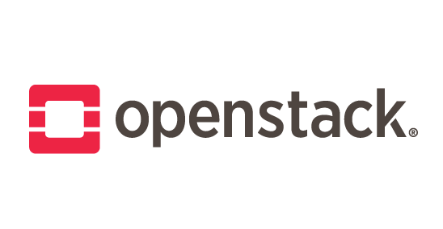
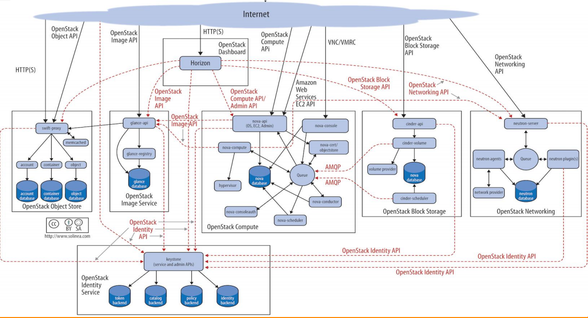

# OPENSTACK

> Notes for Openstack certification.

Managing Openstack and it's components on Linux environment.

## Built With

- Major languages
- Frameworks
- Technologies used

## Live Demo

[No live demo yet](https://livedemo.com)

## Getting Started

### Cloud computing

Def: delivery of different services through the Internet. These resources include tools and apps like data storage, servers, databases, networking and software.

How it works:

    - Buy service
    - Pay based on use
    - From the Internet to any device
    - Multi-user and dynamic

Features:

    - Agility
    - Low cost
    - Scalability and elasticity
    - High security
    - Easy maintenance

Services: 

    - Software-as-a-service(SaaS): involves the licensure of a software app to customers. Licenses are typically provided through a pay-as-you-go model or on-demand.
 
    - Infraestructure-as-a-service(IaaS): method for delivering everything from OS to servers and storage through IP-based connectivity as part of an on-demand service.

    - Platform-as-a-service(PaaS): platform for creating software that is delivered via the Internet.

Significant software and companies that provides cloud computing:

    - AWS Amazon
    - Azure Microsoft
    - Google Cloud Platform

    Own management

    - VMWare vRealize
    - Openstack
    - OpenNebula
    - VeritasCloud

### Openstack

Def: cloud operating system that controls large pools of compute, storage and networking resources throughout a datacenter, all managed and provisioned through APIs with common authentication mechanisms. Openstack provides IaaS services, being modular and 100% adaptable. 

Features:

    - Most powerful open-source cloud application
    - Divided in projects to modulate components
    - Has different distributions
    - Many ways to install
    - Different versions that are constantly updated

Components: 

    - Nova (Compute)
    - Neutron (Networking)
    - Horizon (Dashboard)
    - Glance (Images)
    - Cinder (storage - Block Storage)
    - Keystone (user management)
    - Swift (object management - Object Storage)
    - Others (Heat, Ceilometer, Manila)

Distributions: 

    - Plenty of distributions 
    - Each company creates its own distribution
    - Installation is different in each case
    - Each distribution works with a certain version

All in one vs multinode: 

A single node installation installs all components like nova or cinder in one single node, and it is basically used for testing. Multinode installs different components along various nodes. It is highly scalable and offers failover in case of node malfunction.

Kolla-Ansible:

Openstack project which provides tools to build Docker container images for Openstack services and provides playbooks to deploy Kolla images. Kolla's mission is to provide production-ready containers and deployment tools for operating Openstack clouds. 

### Prerequisites: System requirements

[LATEST - System requirements](https://docs.openstack.org/horizon/latest/install/system-requirements.html)

### KOLLA ANSIBLE Setup

[Enviroment setup](https://docs.openstack.org/newton/install-guide-rdo/environment.html)

[Overview Requirements](https://docs.openstack.org/project-deploy-guide/openstack-ansible/latest/overview-requirements.html)

### KOLLA ANSIBLE Install

[LATEST All-in-one Install](https://docs.openstack.org/openstack-ansible/latest/user/aio/quickstart.html)

[LATEST Multinode Install](https://docs.openstack.org/kolla-ansible/latest/user/quickstart.html)

### Usage

Access openstack CLI

  - `. /etc/kolla/admin-openrc.sh`
  - `http://PUBLICIP` Access dashboard through browser

[Create provider network on VLAN Public IPs](https://docs.openstack.org/install-guide/launch-instance-networks-provider.html)

  - `/etc/kolla/config/neutron/ml2_config.ini`: Add
    - `[ml2_type_vlan]`
    - `network_vlan_ranges = physnet1`
    - `[ovs]`
    - `network_vlan_ranges = physnet1`
  - `kolla-ansible -t neutron reconfigure`
  - `openstack network create --external --provider-physical-network physnet1 --provider-network-type vlan --provider-segment 703 provider`
  - `openstack subnet create --network provider --subnet-range IP/MASK --allocation-pool start=PUBLICIP, end=PUBLICIP --dns-nameserver 8.8.8.8 --gateway IP provider-subnet`

Create project and launch instance

- Create project
  - `openstack project create --description "DESC" PROYECTNAME`
  - `cp /etc/kolla/admin-openrc.sh /etc/kolla/PROYECTNAME-openrc.sh`
  - Edit this file: `PROYECT_NAME=PROYECTNAME`

- Create new user
  - `openstack user create --project PROYECTNAME --password PASSWORD USERNAME`

- Asign role to users
  - `openstack role add --user USERNAME --project PROYECTNAME ROLENAME`

- [Create project network](https://docs.openstack.org/install-guide/launch-instance-networks-selfservice.html)
  - `openstack network create NETWORKNAME`
  - `openstack subnet create SUBNETNAME --network provider --subnet-range IP/MASK --dns-nameserver 8.8.8.8`

- Create router
  - `openstack router create ROUTERNAME`
  - `openstack router set ROUTERNAME --external-gateway provider`
  - `openstack router add subnet ROUTERNAME SUBNETNAME`
  - `openstack router set ROUTERNAME --external-gateway provider --fixed-ip-subnet=provider-subnet,ip-adress=IP`

- Create floating ip
  - `openstack floating ip create --subnet SUBNETNAME NETWORKNAME`

- Create flavor
  - `openstack flavor create --ram SIZEMB --disk SIZEGB --vcpus NUMCPU --public | --private --project PROJECTNAME FLAVORNAME`

- Create image from qcow2
  - `openstack image create --disk-format qcow2 --container-format bare --public | --private --file ./IMAGE.qcow2 IMAGENAME`

- Launch instance
  - `openstack server create --image IMAGENAME --flavor FLAVORNAME --key-name KEYNAME --network NETWORKNAME SERVERNAME`

## Authors

👤 **AiranGlez**

- GitHub: [@githubhandle](https://github.com/AiranGlez)
- LinkedIn: [LinkedIn](www.linkedin.com/in/airanglez)

## 🤝 Contributing

Contributions, issues, and feature requests are welcome!

Feel free to check the [issues page](issues/).

## Show your support

Give a ⭐️ if you like this project!

## Acknowledgments

- Hat tip to anyone whose code was used
- Inspiration
- etc

## 📝 License

This project is [MIT](lic.url) licensed.
